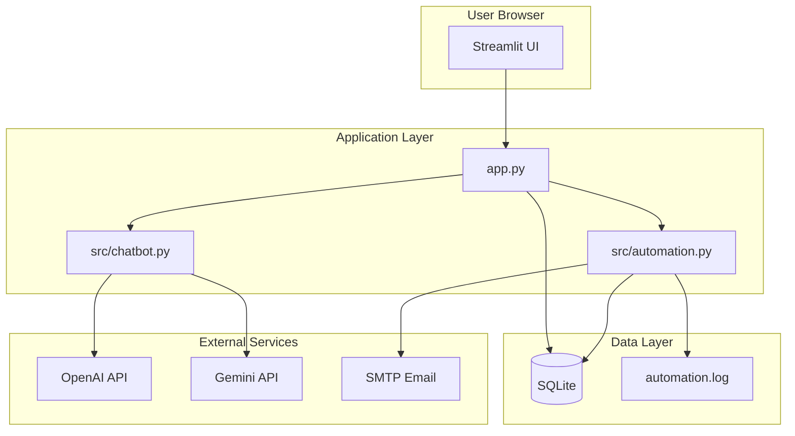

# AI-Powered Business Automation Assistant

A full-stack business assistant with **AI chatbot**, **lead capture**, **SQLite storage**, **automation workflows**, and an **admin dashboard**. Built with Python and Streamlit.

## Repository

**GitHub:** [https://github.com/Tejashvini-478/chatbot](https://github.com/Tejashvini-478/chatbot)

## Live demo

> **Deploy to Streamlit Cloud** (free, public URL) — see [Deployment](#deployment) below.  
> After deploying, add your live URL here: `https://your-app.streamlit.app`

## Features (assessment checklist)

| Module | Implementation |
|--------|----------------|
| AI Assistant / Chatbot | OpenAI or Google Gemini; demo mode without API keys |
| Lead Capture | Streamlit form with validation |
| Data Storage | SQLite (`data/business_assistant.db`) + CSV export |
| Automation | Lead → email + logging; Chat → auto-response + audit trail |
| Admin Dashboard | Password-protected leads, chats, automation events |
| Deployment | Streamlit Cloud / Render ready |

## Architecture



See [docs/ARCHITECTURE.md](docs/ARCHITECTURE.md) for a detailed breakdown.

## Project structure

```
chatbot/
├── app.py                 # Main Streamlit application
├── requirements.txt
├── .env.example
├── src/
│   ├── config.py          # Environment & paths
│   ├── database.py        # SQLite CRUD
│   ├── chatbot.py         # LLM integration
│   └── automation.py      # Email & workflow logging
├── data/                  # SQLite DB & logs (created at runtime)
├── docs/
│   └── ARCHITECTURE.md
└── .streamlit/
    └── config.toml
```

## Quick start (local)

### 1. Clone and install

```bash
cd chatbot
python -m venv .venv

# Windows
.venv\Scripts\activate

# macOS/Linux
source .venv/bin/activate

pip install -r requirements.txt
```

### 2. Configure environment

```bash
copy .env.example .env   # Windows
# cp .env.example .env   # macOS/Linux
```

Edit `.env`:

```env
GEMINI_API_KEY=...             # recommended
LLM_PROVIDER=gemini            # openai | gemini
GEMINI_MODEL=gemini-2.5-flash  # Gemini model id
# Or: OPENAI_API_KEY=sk-...
ADMIN_PASSWORD=your_secure_password

# Optional — enables lead email notifications
SMTP_USER=your@gmail.com
SMTP_PASSWORD=app_password
NOTIFY_EMAIL=admin@company.com
```

### 3. Run

```bash
streamlit run app.py
```

Open **http://localhost:8501**

- **Demo mode**: Works without API keys (rule-based sample replies).
- **Live AI**: Set `OPENAI_API_KEY` or `GEMINI_API_KEY`.

Default admin password: `admin123` (override with `ADMIN_PASSWORD`).

## Automation workflows

1. **Lead capture → storage + notification**  
   Form submit → SQLite `leads` table → SMTP email (if configured) → `automation_events` + `data/automation.log`

2. **Chat interaction → auto-response + logging**  
   User message → LLM reply → `chat_logs` table → automation event logged

## Deployment

### Streamlit Community Cloud (recommended)

1. Push this repo to **GitHub**.
2. Go to [share.streamlit.io](https://share.streamlit.io) → **New app**.
3. Repository: your repo, **Main file path**: `app.py`
4. **Secrets** (Settings → Secrets), paste:

```toml
OPENAI_API_KEY = "sk-..."
ADMIN_PASSWORD = "your_secure_password"
# Optional SMTP
SMTP_USER = "..."
SMTP_PASSWORD = "..."
NOTIFY_EMAIL = "..."
```

5. Deploy — copy the public URL for your submission.

### Render (alternative)

1. New **Web Service** → connect GitHub repo.
2. **Build command**: `pip install -r requirements.txt`
3. **Start command**: `streamlit run app.py --server.port=$PORT --server.address=0.0.0.0`
4. Add environment variables from `.env.example`.

> **Note:** SQLite on free tiers may reset on redeploy. For production, consider PostgreSQL; this project uses SQLite per assessment requirements.

## Demo video (5–7 min) outline

1. **Intro** (30s) — Project goal and architecture diagram.
2. **AI Assistant** (2 min) — Sample business/course questions; show live vs demo mode.
3. **Lead Capture** (1.5 min) — Submit form; show success and automation message.
4. **Admin Dashboard** (1.5 min) — Login, view leads/chats/events, CSV export.
5. **Automation** (1 min) — Explain email + logging workflows; show `automation_events` tab.
6. **Deployment** (30s) — Show live URL and GitHub repo.

## Submission checklist

- [ ] GitHub repository link
- [ ] Live hosted project link (Streamlit Cloud / Render)
- [ ] 5–7 minute demo video
- [ ] Architecture diagram (in README + `docs/ARCHITECTURE.md`)
- [ ] README / documentation (this file)

## Tech stack

- **Python 3.10+**
- **Streamlit** — UI, forms, dashboard
- **SQLite** — Leads, chat logs, automation events
- **OpenAI / Google Gemini** — LLM responses
- **SMTP** — Optional lead email notifications

## License

MIT — assessment / portfolio use.
